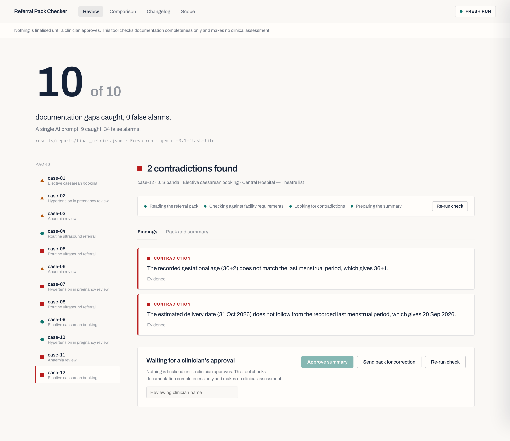

# Referral Pack Checker

A woman is referred from a health centre to a district hospital for a planned
caesarean. Before she travels, a nurse assembles a referral pack from her antenatal
card and the clinic register. The pack arrives with her blood group missing — it was
never copied across from the card. She waits at the hospital while it is chased, or a
sample is taken and sent, or she is told to come back another day. Every clinical
decision along the way was correct. The delay came from the paperwork.

This tool checks the paperwork. It reads a referral pack, checks the fields against
the receiving facility's documented requirements, finds what is missing, out of date,
or internally contradictory, and drafts a corrected summary and a "before you send"
list. **A qualified clinician reviews and approves every output. The tool makes no
clinical judgment of any kind** — see [SCOPE_AND_SAFETY.md](SCOPE_AND_SAFETY.md).

## Result

**The agent workflow caught 10 of 10 seeded documentation gaps with 0 false alarms.
A single end-to-end prompt caught 9, and raised 34 findings against packs that were
fine — 5 of them against the two control packs.**

Numbers below are from `results/reports/final_metrics.json`, produced by a fresh run
against the Gemini API (`gemini-3.1-flash-lite`); every request and response is
committed under `results/raw/`, so the run replays offline.



| Metric | Agent workflow | Single prompt |
|---|---:|---:|
| Seeded defects caught (of 10) | **10** | 9 |
| False flags | **0** | 34 |
| False flags on the two control packs | **0** | 5 |
| Contradictions caught (of 6) | **6** | 5 |
| Invented values (value with no source, or where ground truth says absent) | **0** | not measured¹ |
| Findings a reviewer must read, per pack | **0.8** | 3.6 |
| Of those, spurious (must be dismissed) | **0%** | 79% |
| Cost per pack | $0.0014 | $0.0003 |

¹ The single prompt has no structured extraction step, so "invented values" is not
directly comparable; its equivalent failure shows up as the 34 false flags, many of
which are contradictions it computed wrongly in its head.

**Human review time (wall clock) is not reported** — it was not measured, and an
estimate next to measured numbers would mislead. The two "findings a reviewer must
read" rows are a computed review-burden proxy (`reviewerLoad` in
`final_metrics.json`); [docs/human-review-time.md](docs/human-review-time.md) gives a
stopwatch protocol to produce the real figure. What a good result looks like was
defined up front in [docs/evaluation-plan.md](docs/evaluation-plan.md).

## What the workflow does

```
referral pack text
      │
      ▼
┌─────────────────┐   model call — reads the semi-structured card into a typed
│  1. Extractor   │   structure. Every field carries a provenance span quoting
└─────────────────┘   the source text. A field it cannot find is marked absent,
      │               never guessed. Retries with the validation error attached,
      │               up to three attempts. Request and response committed.
      ▼
┌─────────────────┐   deterministic code — compares the extracted structure to
│ 2. Requirements │   the requirement set. Per field: present and current,
│    checker      │   present but stale, absent, or conditionally required and
└─────────────────┘   absent.
      │
      ▼
┌─────────────────┐   deterministic code — six calendar and arithmetic rules.
│ 3. Consistency  │   Gestational age vs LMP, EDD vs LMP, no future dates, no
│    verifier     │   date before LMP, parity vs obstetric history, no
└─────────────────┘   placeholder in a "present" field. Reports both sides of a
      │               contradiction; resolves nothing.
      ▼
┌─────────────────┐   model call — plain-English summary from verified fields
│ 4. Summariser   │   only, plus the gap list. Cannot characterise a value as
└─────────────────┘   normal, abnormal, concerning or reassuring. Retries if it
      │               does.
      ▼
   human checkpoint — the workflow halts. A named clinician approves, sends back,
   or re-runs. Nothing is finalised without approval. There is no send action.
```

Per-facility memory: a local JSON store of which fields a referring facility has
repeatedly left out. When a facility has a track record on a field (≥ 2 packs seen,
field missing in ≥ 2 of them), that field is surfaced first in the gap list, as a
prompt to check. It never pre-fills a value and never asserts anything about the
current pack. In the twelve-pack evaluation each facility appears once, so memory has
no history to act on and does not change what is caught — the changelog says so, and
`npm run memory-demo` shows the mechanism on three packs from one facility.

### Why extraction is a model call and checking is deterministic

The messy step — reading "GA 30+2 (recorded at visit 24/08/26)" and a blood group
written only as `// grp B+` in the margin — is where a model has a real advantage
over rules. The checking step is arithmetic and calendar logic. A rule like "the
gestational age must agree with the LMP" should not be re-decided by a model on every
run, because it will occasionally decide differently. The changelog measures
this: at temperature 0 the model's requirement check did not vary in the *number* of
findings across three runs (stdev 0 either way), but it was wrong in *content* — on
three packs it called a haemoglobin taken four to six days ago "stale". Moving the
check into code took false flags from 5 to 0.

## Repository

| Path | What |
|---|---|
| `src/domain/` | typed schema, requirement logic, the six consistency rules |
| `src/agents/` | extractor and summariser (model calls), the pipeline, trajectory logging |
| `src/checks/` | deterministic requirement and consistency checkers |
| `src/memory/` | per-facility recurring-omission store |
| `src/baseline/` | the single-prompt baseline |
| `src/eval/` | configuration runner, scoring, report builder |
| `src/provider/` | Gemini client, replay adapter, committed-response reader |
| `app/`, `src/ui/` | the dashboard |
| `fixtures/packs/` | twelve synthetic referral packs + manifest |
| `fixtures/requirements/` | four requirement sets (illustrative) |
| `fixtures/ground_truth/` | one file per case, written before any model was run |
| `results/raw/` | committed model requests and responses |
| `results/trajectories/` | readable per-stage traces, one per pack, + baseline, memory, memory-demo, extraction/summariser retry |
| `results/reports/` | metrics tables |
| `docs/` | evaluation plan (pre-registered), human-review-time protocol, dashboard screenshot |

## Replay vs fresh

- **fresh** — real Gemini API calls. Needs `GEMINI_API_KEY` in `.env.local`. The exact request and raw response for every call are written to `results/raw/`.
- **replay** — reads those committed responses and re-runs scoring with no network call. A judge with no key runs `npm run eval -- --mode replay`.

Every surface — the CLI output, the dashboard header, the reports — labels which mode
produced what is on screen. A replay run is never presented as a fresh one.

## What existed before the hackathon

Nothing in `src/`, `app/`, `fixtures/` or `results/` existed before. The visual
design was drafted first as a Claude Design canvas (kept under `design/` for
reference) and then built as the Next.js dashboard here. Everything else — the domain
model, the fixtures, the ground truth, the agent workflow, the deterministic
checkers, the baseline, the evaluation harness — was written during the hackathon.

## Tools and licences

| Tool | Licence |
|---|---|
| Next.js 14 | MIT |
| React 18 | MIT |
| `@google/genai` (Gemini SDK) | Apache-2.0 |
| Zod | MIT |
| Vitest | MIT |
| tsx | MIT |
| TypeScript | Apache-2.0 |
| Model: Google `gemini-3.1-flash-lite` via the Gemini API | commercial API, Google's terms |

Fonts: Archivo (SIL Open Font License), served from Google Fonts.

## Reproduction

See [REPRODUCTION.md](REPRODUCTION.md). Short version:

```bash
npm install
cp .env.example .env.local          # add GEMINI_API_KEY for fresh mode
npm test
npm run eval -- --mode replay       # offline, from committed responses
npm run dev                         # dashboard at localhost:3000
```

- [CHANGELOG_IMPROVEMENT.md](CHANGELOG_IMPROVEMENT.md) — every iteration, each linked to its evidence file
- [docs/evaluation-plan.md](docs/evaluation-plan.md) — what a good result was defined to be, before the run
- [docs/human-review-time.md](docs/human-review-time.md) — the review-burden proxy and a protocol for the real figure
- [results/trajectories/](results/trajectories/) — readable traces, one per pack, plus baseline, memory, both retry loops
- 
## Main failure mode

The most dangerous thing this system can do is fill a gap instead of reporting it. A
model asked to produce a complete referral summary will produce a complete-*looking*
one, inventing the shape of a value it never found. The defence is structural:
provenance on every extracted field, and an unlocatable field treated as absent by
construction — `fieldPresent()` returns false without a source span — rather than by
asking the model nicely. The changelog's "invented values" counter tracks this: with structured extraction
and a provenance span on every field, it was 0 from Iteration 1 onward.

## Hot take

Completeness and correctness are different properties. A checker that verifies
presence will confidently approve a document that contradicts itself — case 12 has
every box ticked and still does not make sense. The lesson for building agents: put
the checks that must never drift into deterministic code, and spend the model's
budget on the messy extraction step, where it actually has an advantage.
